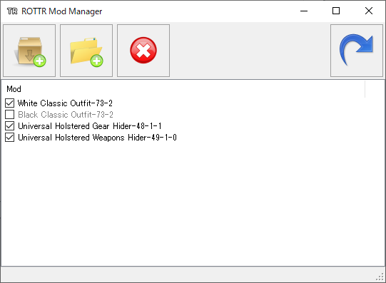

# ROTTR Mod Manager
Mod manager for Rise of the Tomb Raider.

Features:
* Version-independent. Mods that originally only worked on older versions of the game can now be installed in the newest one (and not just the Steam version).
* Fast - can quickly install so-called "deep search" mods (where all references to a certain resource are replaced) regardless of which other mods are already installed.
* Creates new game archives rather than modifying existing ones.
* Can install mods from a folder or straight from a .zip, .7z, or .rar archive, either using the toolbar buttons or by drag&drop onto the window or .exe.
* Individual mods can be removed or even temporarily disabled, without having to start from scratch and reinstalling all the other mods.
* Automatically reinstalls mods when a change in the original game files is detected (e.g. because a DLC was installed).

Limitations:
* While meshes and textures in the mod are matched to the game files by name rather than index (and should therefore always be installed correctly), other resources like sounds, animations and .dtp files don't have a name and are therefore matched by their index (among resources of the same type), which may not always work.
* Text files in mods such as "Section 1060.txt", which are used for overwriting e.g. several different game textures with a single mod file, are not supported.

[Download](https://github.com/arcusmaximus/RottrModManager/releases)
